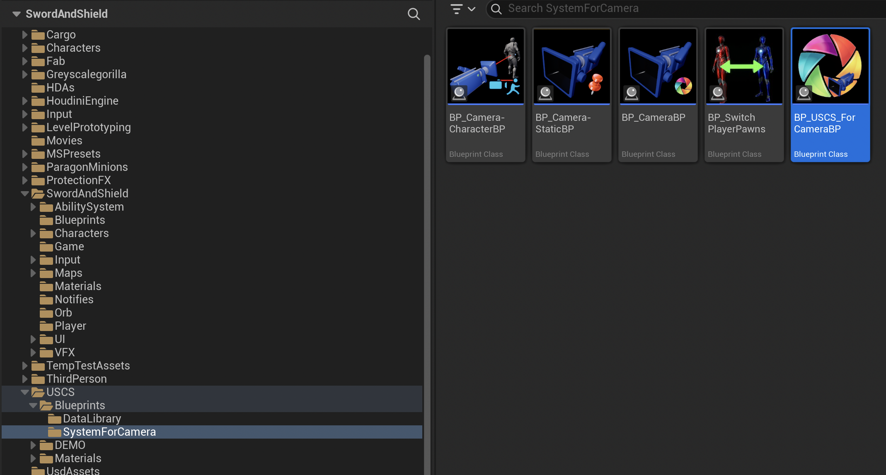
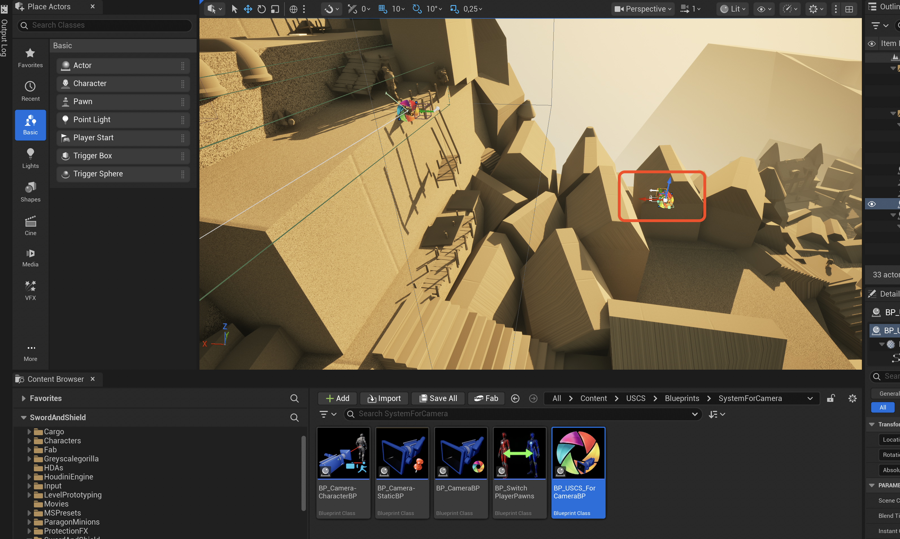
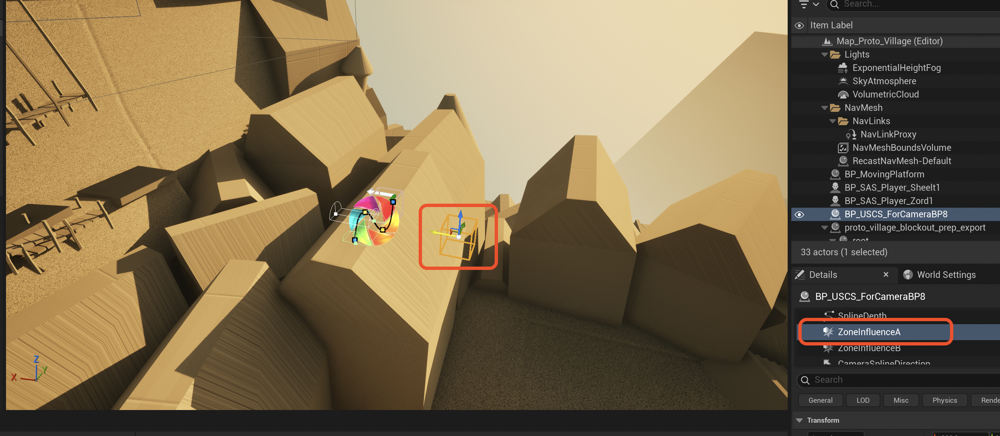
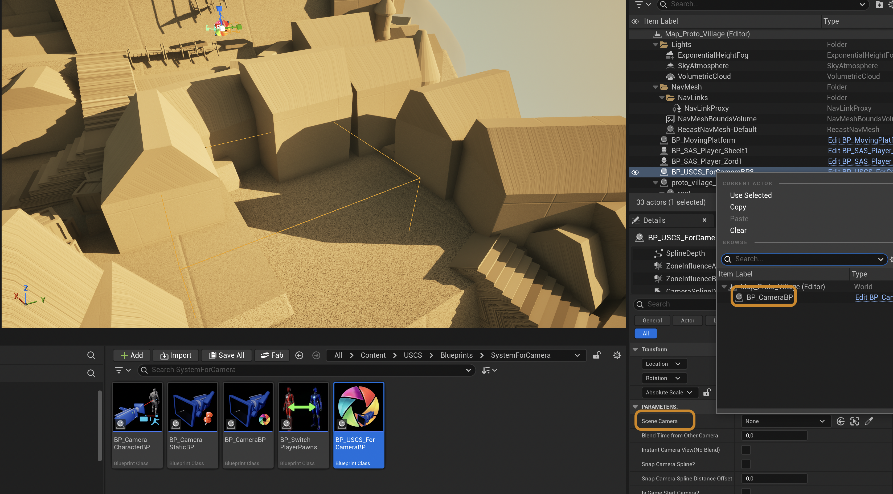

# Camera System

## References
Video's for all the capabilities available using the USCS Camera system
[USCS System Playlist](https://www.youtube.com/playlist?list=PL4lj7_DSubup_DT8wNIplO-mJNSP_E3V6)

## Position Camera in Level

1. Select USCS Camera Blueprint

2. Drag and drop the BP USCS for Camera BP in your level

3. Draw the Detection Zone

> Make sure that the zones of different USCS Camera BP's are **NOT** overlapping. Rule of thumb: make sure the player capsule fits in between different zones.

4. Select the active Camera Blueprint

