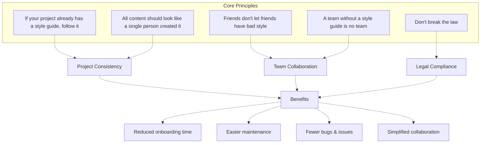
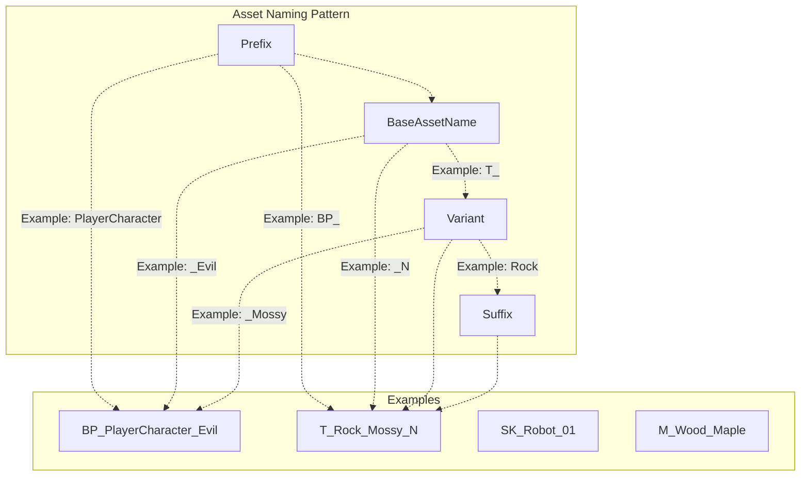
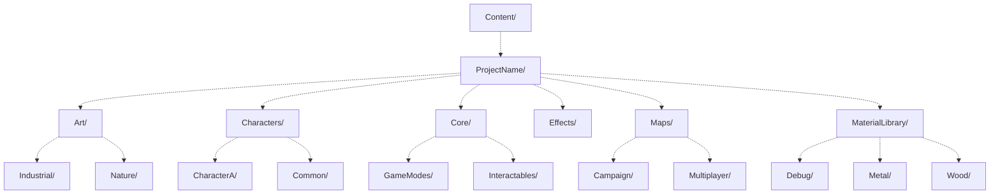
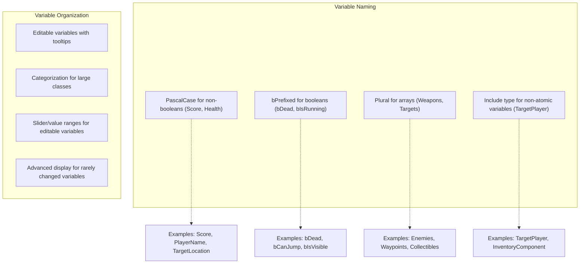
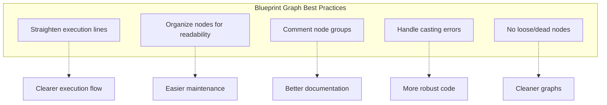
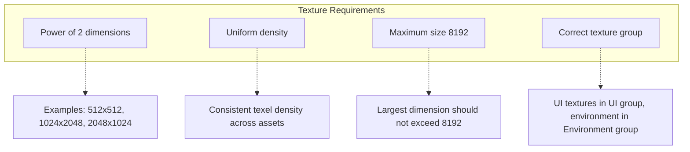

# UE5 Style Guide

The UE5 Style Guide is a comprehensive set of standards and best practices for organizing, naming, and structuring assets and code in Unreal Engine 5 projects. This guide aims to establish consistency across projects, improve team collaboration, and reduce common issues that arise from disorganized content.

For information about the implementation of these guidelines through automated checks, see [Linter Plugin](/Allar/ue5-style-guide/3-linter-plugin).

## Purpose and Scope

This style guide covers:

* Naming conventions for all asset types
* Content directory structure
* Blueprint coding standards
* Guidelines for specific asset types (static meshes, textures, levels)
* Best practices for maintaining quality and consistency

The guide is designed to be applied to any UE5 project, whether developed by a single person or a large team. Following these standards helps ensure that all project content looks like it was created by a single person, even when multiple contributors are involved.

Sources: [README.md L1-L41](https://github.com/Allar/ue5-style-guide/blob/198a8550/README.md#L1-L41)

 [README.md L204-L249](https://github.com/Allar/ue5-style-guide/blob/198a8550/README.md#L204-L249)

## Core Principles

The UE5 Style Guide is built around several fundamental principles that guide its recommendations:

1. **Follow Existing Guides**: If your project already has an established style guide, it should be respected. Any inconsistencies should defer to the existing guide.
2. **Unified Appearance**: All structure, assets, and code should look like a single person created it, regardless of how many people contributed.
3. **Encourage Good Practices**: Team members should help each other maintain good style.
4. **Style Guide as Foundation**: A solid style guide is fundamental to effective team collaboration.
5. **Legal Compliance**: Projects should respect copyright, trademark, and licensing restrictions.

Sources: [README.md L204-L249](https://github.com/Allar/ue5-style-guide/blob/198a8550/README.md#L204-L249)

## Style Guide Organization

The UE5 Style Guide is organized into several major sections, each focusing on a specific aspect of Unreal Engine development:

```mermaid
flowchart TD

SG["UE5 Style Guide"]
ANC["1. Asset Naming Conventions"]
CDS["2. Content Directory Structure"]
BP["3. Blueprints"]
SM["4. Static Meshes"]
NG["5. Niagara"]
LVL["6. Levels/Maps"]
TX["7. Textures"]
ANC1["Base Asset Name Pattern"]
ANC2["Asset Type Prefixes"]
ANC3["Asset Name Modifiers"]
CDS1["Project-specific Top Level"]
CDS2["Folder Naming Rules"]
CDS3["Standard Folders"]
BP1["Variables"]
BP2["Functions & Events"]
BP3["Graphs"]
SM1["UVs"]
SM2["LODs"]
SM3["Collision"]
LVL1["No Errors or Warnings"]
LVL2["Lighting Built"]
LVL3["No Z-Fighting"]
TX1["Power of 2 Dimensions"]
TX2["Density"]
TX3["Size Limits"]

SG -.-> ANC
SG -.-> CDS
SG -.-> BP
SG -.-> SM
SG -.-> NG
SG -.-> LVL
SG -.-> TX
ANC -.-> ANC1
ANC -.-> ANC2
ANC -.-> ANC3
CDS -.-> CDS1
CDS -.-> CDS2
CDS -.-> CDS3
BP -.-> BP1
BP -.-> BP2
BP -.-> BP3
SM -.-> SM1
SM -.-> SM2
SM -.-> SM3
LVL -.-> LVL1
LVL -.-> LVL2
LVL -.-> LVL3
TX -.-> TX1
TX -.-> TX2
TX -.-> TX3
```

Each section contains detailed guidelines, examples, and best practices specific to that aspect of UE5 development.

Sources: [README.md L38-L158](https://github.com/Allar/ue5-style-guide/blob/198a8550/README.md#L38-L158)

## Asset Naming Conventions

Asset naming is one of the most critical aspects of the UE5 Style Guide. Proper naming ensures assets can be easily found, managed, and understood by all team members.

### Base Asset Name Pattern

All assets follow the pattern: `Prefix_BaseAssetName_Variant_Suffix`

* **Prefix**: Identifies the asset type (e.g., BP_ for Blueprint, M_ for Material)
* **BaseAssetName**: Core identifier for the asset (e.g., Rock, Character, Weapon)
* **Variant**: Optional identifier for specific versions (e.g., _Small, _Damaged, _01)
* **Suffix**: Additional type-specific information (e.g., _N for normal textures)

### Common Asset Type Prefixes

| Asset Type | Prefix | Example |
| --- | --- | --- |
| Blueprint | BP_ | BP_PlayerController |
| Material | M_ | M_Wood |
| Material Instance | MI_ | MI_Wood_X |
| Static Mesh | SM_ | SM_Chair |
| Skeletal Mesh | SK_ | SK_Mannequin |
| Texture | T_ | T_Brick_D |
| Particle System | PS_ | PS_Fire |
| Widget Blueprint | WBP_ | WBP_MainMenu |
| Animation | A_ | A_Character_Run |
| Animation Montage | AM_ | AM_Character_Attack |
| Sound | S_ | S_Explosion |
| Sound Cue | SC_ | SC_Explosion_Cue |
| Meta Sound | MS_ | MS_Explosion_Meta |

### Texture Suffixes

Textures use additional suffixes to indicate their purpose:

| Texture Type | Suffix | Example |
| --- | --- | --- |
| Diffuse/Albedo | _D | T_Rock_D |
| Normal | _N | T_Rock_N |
| Roughness | _R | T_Rock_R |
| Metallic | _M | T_Rock_M |
| Ambient Occlusion | _O | T_Rock_O |
| Emissive | _E | T_Rock_E |

Multiple texture maps can be packed into channels of a single texture, with the suffix indicating the packed content (e.g., `_ERO` for Emissive, Roughness, and Occlusion).

Sources: [README.md L277-L449](https://github.com/Allar/ue5-style-guide/blob/198a8550/README.md#L277-L449)

## Content Directory Structure

The UE5 Style Guide recommends a specific approach to organizing content directories that emphasizes logical grouping and clear separation of assets.

### Project-Specific Top Level Folder

All project assets should exist within a top-level folder named after the project:

### Key Directory Structure Rules

1. **Always use PascalCase for folder names** - Use capitalized first letters with no spaces (e.g., `PlayerCharacters`).
2. **Never use spaces or special characters** - Avoid using spaces, Unicode characters, or symbols in folder names.
3. **Use a `Maps` folder for all level files** - All map files should be placed in a folder called `Maps` within the project folder.
4. **Use a `Core` folder for critical blueprints** - Essential game frameworks and base classes should be in a `Core` folder.
5. **Don't create redundant asset type folders** - Avoid folders named `Assets`, `Meshes`, `Textures`, etc., as asset types are already indicated by their prefixes.
6. **Use `MaterialLibrary` for shared materials** - Global materials, textures, and material functions should go in a `MaterialLibrary` folder.
7. **No empty folders** - The content browser should be free of empty folders.
8. **Developers folder for testing** - Use a `Developers` folder (outside the project folder) for experimental assets.

Sources: [README.md L542-L783](https://github.com/Allar/ue5-style-guide/blob/198a8550/README.md#L542-L783)

## Blueprint Guidelines

Blueprints are a critical part of UE5 development, and maintaining clean, consistent Blueprint code is essential for project health.

### Variables

Blueprint variables should follow these conventions:

Key rules for variables:

1. **Use descriptive nouns** - Variables should be clear, unambiguous nouns.
2. **Use PascalCase** - All non-boolean variables should use PascalCase.
3. **Prefix booleans with 'b'** - Boolean variables should be prefixed with a lowercase 'b' (e.g., `bDead`).
4. **Consider context** - Avoid redundancy with the class name (e.g., in a `BP_PlayerCharacter`, use `Score` not `PlayerScore`).
5. **Be thoughtful about editable variables** - Only make variables editable if they're meant to be configured.

### Functions and Events

Blueprint functions and events should be named according to their purpose and behavior:

1. **Use verbs for functions** - Functions should start with verbs (e.g., `Fire`, `Jump`, `GetPlayerLocation`).
2. **Ask questions for boolean returns** - Functions returning booleans should ask questions (e.g., `IsAlive`, `CanJump`).
3. **Prefix event handlers with 'On'** - Event handlers should start with 'On' (e.g., `OnDeath`, `OnPickup`).
4. **Prefix RPCs with target** - Remote procedure calls should be prefixed with `Server`, `Client`, or `Multicast`.
5. **Include return nodes** - All functions must have return nodes for clarity.
6. **Keep functions manageable** - No function should have more than 50 nodes.

### Blueprint Graphs

Key rules for Blueprint graphs:

1. **No spaghetti** - Wires should have clear beginnings and endings.
2. **Align wires, not nodes** - Focus on keeping execution lines straight.
3. **Prioritize white execution lines** - Execution flow should be visually clear.
4. **Use comments** - Wrap related nodes in comment blocks explaining their purpose.
5. **Handle casting errors** - Include appropriate error handling for casts.
6. **No dangling nodes** - Remove unused or disconnected nodes.

Sources: [README.md L784-L1266](https://github.com/Allar/ue5-style-guide/blob/198a8550/README.md#L784-L1266)

## Static Mesh Guidelines

Static meshes require specific attention to ensure they perform well and maintain visual quality:

1. **UV Requirements** * All meshes must have UVs * No overlapping UVs for lightmaps * Proper unwrapping for texturing
2. **Level of Detail (LOD)** * Set up appropriate LODs for meshes viewed at varying distances * Configure proper screen sizes for LOD transitions
3. **Collision** * All meshes must have collision defined * Collision should be well-formed to the asset
4. **Grid Snapping** * Modular assets should snap cleanly to the grid * Assets should work with a 10-unit grid minimum
5. **Scaling** * All meshes should be appropriately scaled for the project * Consistent scale across related assets

Sources: [README.md L1267-L1319](https://github.com/Allar/ue5-style-guide/blob/198a8550/README.md#L1267-L1319)

## Texture Guidelines

Textures have specific requirements to ensure optimal performance and visual quality:

Key rules for textures:

1. **Power of 2 dimensions** - All texture dimensions should be powers of 2 (e.g., 512, 1024, 2048).
2. **Uniform density** - Maintain consistent texel density across assets.
3. **Size limits** - No texture should exceed 8192 in either dimension.
4. **Texture groups** - Assign the correct texture group based on the texture's use.

Sources: [README.md L1403-L1437](https://github.com/Allar/ue5-style-guide/blob/198a8550/README.md#L1403-L1437)

## Level/Map Guidelines

Levels (also called maps) require special attention to ensure they run well and look good:

1. **No Errors or Warnings** * All levels should load with zero errors or warnings * Run Map Check to verify before finalizing
2. **Built Lighting** * All distributed levels should have lighting built * No unbuilt lighting in release builds
3. **No Z-Fighting** * Ensure no visible polygon z-fighting in player-accessible areas * Check at various distances and angles
4. **Marketplace Requirements** * Include Overview and Demo maps for marketplace submissions * Document usage in Demo maps

Sources: [README.md L1342-L1402](https://github.com/Allar/ue5-style-guide/blob/198a8550/README.md#L1342-L1402)

## Marketplace Compatibility

The UE5 Style Guide is largely compatible with the Unreal Engine Marketplace Technical Review Checklist, with some exceptions:

| Area | Compatibility | Notes |
| --- | --- | --- |
| Naming Conventions | ✓ Compatible | The guide's naming conventions align with marketplace requirements |
| Directory Structure | ✗ Not Compatible | The guide recommends a project-based structure while marketplace prefers asset-type-based folders |
| Static Meshes | ✓ Compatible | The guide's mesh requirements align with marketplace standards |
| Textures | ✓ Compatible | All texture requirements match marketplace expectations |
| Blueprints | ✓ Compatible | Blueprint guidelines meet or exceed marketplace standards |
| Levels | ✓ Compatible | The level requirements align with marketplace expectations |

For marketplace submissions, consider adjusting your directory structure to meet their requirements while maintaining the naming conventions and quality standards from this guide.

Sources: [marketplace-compatibility.md L1-L184](https://github.com/Allar/ue5-style-guide/blob/198a8550/marketplace-compatibility.md#L1-L184)

## Style Guide Implementation

The UE5 Style Guide is meant to be a living document that evolves with your project's needs. Teams should consider:

1. **Creating project-specific amendments** - Adapt the guide to fit specific project requirements
2. **Automating compliance** - Use the Linter plugin to automatically check for style compliance
3. **Incorporating into workflows** - Make style checks part of your regular review process
4. **Documenting exceptions** - When deviating from the guide, document the reasons clearly

By consistently applying these guidelines, teams can maintain cleaner projects, reduce confusion, and focus more on creating great games rather than hunting down inconsistencies and organization issues.

Sources: [README.md L1452-L1458](https://github.com/Allar/ue5-style-guide/blob/198a8550/README.md#L1452-L1458)